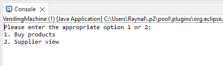

## Interview Question: Vending Machine Program

### Problem Statement:
Design a Vending Machine which  

- Accepts coins of 1, 5, 10, 25, 50, 100
- Accepts an inventory of products along with a unit price for each one, e.g. 10xCoke each 25p, 15xPepsi each 35p, 12xSprite each 45p.
- Accepts an initial float of coins.
- Allow users to buy 1 or more products in one transaction given a set of coins provided by the user. This should return the selected product(s) and remaining change if any.
- Allow the vending machine supplier to request a full inventory of the machine.
- Allows the vending machine supplier to update the stock and/or the float of coins.

#### Requirements:
- Provide a command line program that satisfies the requirements.
- A readme file summarizing the design and instructions on exercising the program.

##### Language: Java

#### Running the program:
`1>` Import the program as a Java Project in your IDE. 
`2>` Run as a Java Application. 
`3>` Enter the required input 

